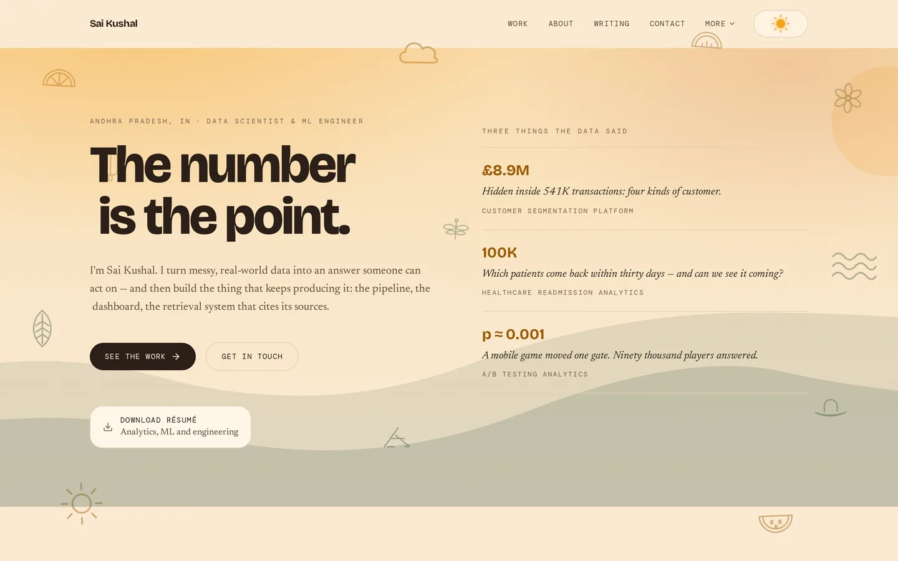
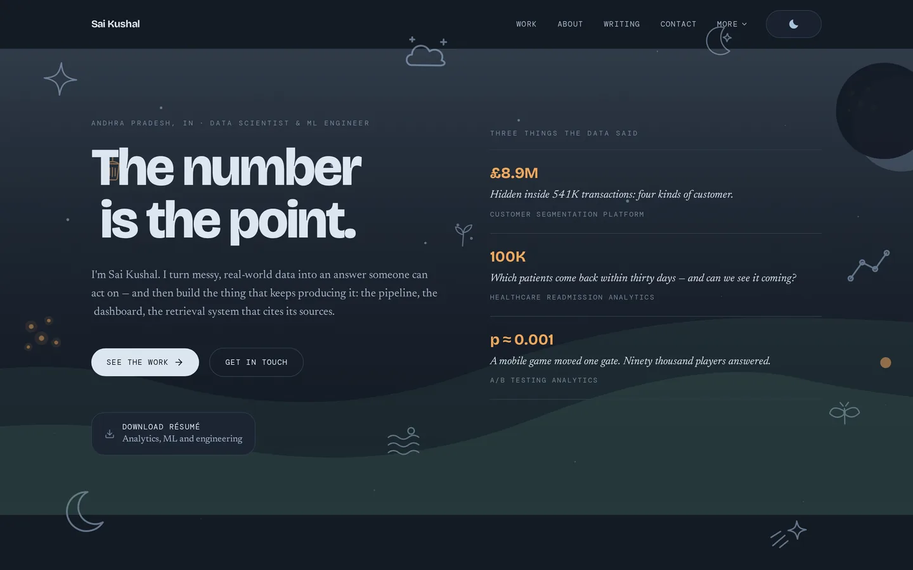
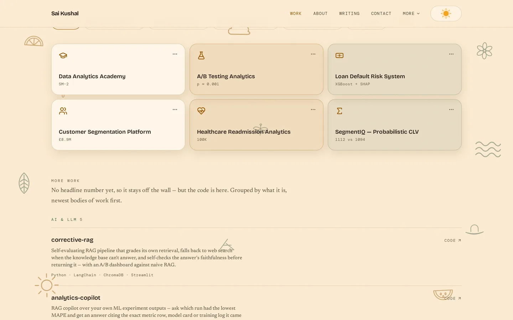
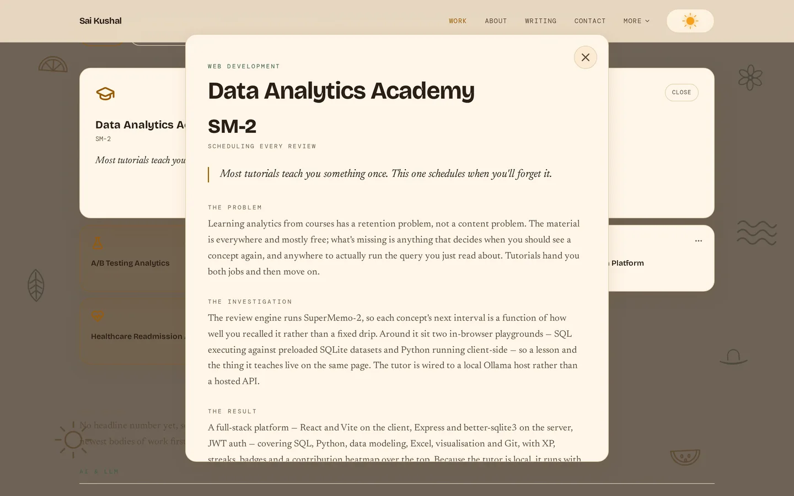

<h1 align="center">Portfolio V5 — <em>Afternoon Porch</em></h1>

<p align="center">
  Personal site for <b>Sai Kushal Vittanala</b> — data scientist and ML engineer.<br>
  A warm, unhurried portfolio where <b>the whole page follows the sun</b>.
</p>

<p align="center">
  <a href="https://saikushal.live"></a>
  
  
  
  
  
</p>

<p align="center">
  
  
</p>

<p align="center"><sub>One control moves both. Everything else follows.</sub></p>

---

## The idea

Most portfolios lead with a grid of project cards. This one leads with **numbers**,
because the work is analysis and the number *is* the finding:

> `£8.9M` — revenue segmented into action  ·  `p ≈ 0.001` — evidence against the move  ·  `100K` — patient encounters modelled

A project reaches the **findings wall** only if it has a headline metric and a
four-beat story behind it. Everything else drops to a quieter grouped list —
six strong cards read stronger than thirty-one even ones. Of 31 projects, 6 are
on the wall.

<p align="center">
  
</p>

Tiles expand in place on shared layout, and the expanded tile opens the full
story in a dialog that **morphs out of the tile itself** rather than fading in
over it.

<p align="center">
  
</p>

## How the light works

The signature is a single control: a sun that dims into a moon. It doesn't just
swap a class — it moves one number, and the entire page follows.

Every colour is a CSS custom property holding an RGB triple, so Tailwind can
still apply opacity to it (`bg-sun/10`) while the theme moves underneath:

| Token | Day | Night |
|---|---|---|
| `--c-surface` | honeyed paper | cool slate |
| `--c-ink` | roasted brown | moon white |
| `--c-sun` | burnt amber | lamp glow |
| `--c-orb` | marigold | moonlight |
| `--c-shade` | garden green | moonlit green |

**Shadow offset, blur and alpha are variables too.** That's what makes the light
feel directional rather than themed — as the sun drops, every shadow on the page
lengthens, softens and turns blue.

`--sun-position` (0 at noon, 1 past the horizon) drives the rest: the sun's rays
retract, a masked circle carves it into a crescent, the hero's window-light wash
slides down and fades, a starfield comes up, and twelve hand-drawn day doodles
cross-fade to their night counterparts in the same positions — so the sky keeps
its composition and only its contents change.

`--c-sun` carries text and icons, so it's held to WCAG AA in both themes.
`--c-orb` is decorative only, which is why it can stay bright.

Under `prefers-reduced-motion` the travel is skipped and the theme simply swaps.

## Performance notes

Two findings from profiling this, both of which were the opposite of the obvious
suspect:

**The theme travel ran at ~11fps** — 13 frames in 1.2s, worst frame 157ms. The
cause was a universal `:where(*, *::before, *::after)` transition creating ~6,400
transitions across 1,071 elements. Removing the *expensive properties*
(`box-shadow`, `fill`, `stroke`) bought almost nothing: 13 → 17 frames. Narrowing
the **selector** to the handful of elements that actually change took it to 34,
worst frame 67ms. `color` is inherited, so putting it on `body` carries every
descendant for free.

**The story dialog opened at 17.5fps.** The suspect was a word-by-word text
reveal creating 382 animated spans; fixing that was worth about one frame per
second. The real cost was a full-viewport `backdrop-filter: blur()`, which
re-renders the grain, doodles, starfield and wallpaper on every frame:

| | fps | worst frame |
|---|---|---|
| with blur | 17.5 | 112ms |
| without | **58.3** | 46ms |

## Stack

**Vite 5** · **React 18** · **TypeScript 5** · **Tailwind 3** · **Motion 13** ·
**Supabase** · React Router 6 · Radix ScrollArea · Lucide

Vite 5 and Tailwind 3 are pinned deliberately — the token system is built on
Tailwind 3's `<alpha-value>` syntax and the project targets Node 18+.

## Run it

```bash
npm install
cp .env.example .env.local   # Supabase URL + anon key
npm run dev                  # http://localhost:5173
```

```bash
npm run build                # tsc + vite
npm run preview
```

The site builds and runs without the env vars — `isSupabaseConfigured`
degrades the contact box and `/admin` gracefully.

## Layout

```
src/
├── theme/          SunArc + useTheme — the signature control
├── data/           all content, no JSX. Edit here, not in components
├── features/
│   ├── home/       hero, about, problem solving, credentials
│   ├── projects/   findings wall, tiles, story dialog
│   ├── blog/       list and post
│   ├── contact/    anonymous note box
│   ├── admin/      Supabase auth, lazy-loaded
│   └── legal/
├── shared/
│   ├── components/ page frame, nav, footer, tile grid, doodles, wallpaper
│   └── motion/     animation primitives + the reduced-motion gate
└── index.css       the light system
```

**Content lives in `src/data/*.ts` and nowhere else.** Adding a project means
adding an object, not writing a component. Categories, filters and counts are
all derived from that data, so nothing goes stale.

## Routes

| Path | |
|---|---|
| `/` | the whole story on one page |
| `/projects` | full wall, filters across both the wall and the list |
| `/about` · `/skills` · `/credentials` · `/coding` | each section, standalone and canonical |
| `/contact` | anonymous note box |
| `/blog` · `/blog/:slug` | writing |
| `/privacy` · `/terms` | legal |
| `/admin` | Supabase auth, message dashboard (lazy-loaded) |

Every section appears both on the landing page and as its own route, so the
dedicated route carries the `canonical` and the landing page links through to it.

## Demo clips

Four featured projects carry short silent recordings of the real Streamlit apps
being used, played inside the story dialog with `preload="none"`. They're
produced by driving the actual apps in a browser — see
[`tools/README.md`](tools/README.md) to re-record.

## Supabase

The contact box inserts `{ message, user_agent }` into a `messages` table — no
name, no email, nothing tracked beyond the browser it was sent from, which is
what the form promises. RLS should allow anonymous `insert` only, with `select`
and `delete` restricted to authenticated users.

---

<p align="center"><sub>© 2026 Vittanala Sai Kushal</sub></p>
